# Crypto pipeline — phased execution plan

## Current state

- Only [`Crypto_pipeline_overview`](Crypto_pipeline_overview) exists in the workspace; there is no `crypto-pipeline/` tree, Docker, or Python package yet.
- Execution order follows **Sections 4 (Phased Implementation)** and **7 (First Week Checklist)** in that document.

## High-level flow

```mermaid
flowchart LR
  P0[Phase0_Foundations]
  P1[Phase1_Infra]
  P2[Phase2_Bronze]
  P3[Phase3_Silver]
  P4[Phase4_Gold]
  P5[Phase5_Marts]
  P6[Phase6_Airflow]
  P7[Phase7_Tests_QA]
  P8[Phase8_CI_CD]
  P9[Phase9_Monitoring]
  P10[Phase10_Docs]
  P0 --> P1 --> P2 --> P3 --> P4 --> P5 --> P6 --> P7 --> P8 --> P9 --> P10
```

---

## Phase 0 — Foundations

**Goal:** Repo skeleton, tooling, empty CI-quality baseline.

| Step | What to do | How to verify |
|------|------------|---------------|
| 0.1 | Create GitHub repo (public) | Remote exists, clone URL ready |
| 0.2 | CoinGecko Demo API key | Key in `.env` only, never committed |
| 0.3 | Install Docker Desktop, Python 3.11+, `uv` or `poetry`, `pre-commit` | `python --version`, `docker version` |
| 0.4 | Scaffold structure from overview Section 3 | Directories match tree (adjust root name to match your folder) |
| 0.5 | `pyproject.toml` or `requirements.txt` + dev deps: `ruff`, `black`, `mypy`, optional `nbstripout` | `pip install -e .` or equivalent |
| 0.6 | `.pre-commit-config.yaml` → ruff, black, mypy | `pre-commit run --all-files` passes |
| 0.7 | `.env.example` (placeholder keys), `.gitignore` including `.env` | No secrets in git |
| 0.8 | Initial `README.md` with architecture summary | Readable quick intro |

**Deliverable:** `pre-commit run --all-files` green on a clean checkout.

---

## Phase 1 — Local infrastructure

**Goal:** `make up` (or `docker compose up`) brings MinIO, Postgres, Airflow; buckets exist.

| Step | What to do | Details |
|------|------------|---------|
| 1.1 | [`docker-compose.yml`](Crypto_pipeline_overview) services: minio, minio-init (mc), postgres:15, airflow (init, webserver, scheduler, worker) | Worker image: PySpark + delta-spark aligned versions |
| 1.2 | `Dockerfile.airflow` | Install Spark/Delta deps per overview; pin **PySpark 3.5+** and **delta-spark 3.2.0** (or current compatible pair from [Delta compatibility matrix](https://docs.delta.io/latest/releases.html)) |
| 1.3 | `minio-init.sh` or init container | Buckets: `bronze`, `silver`, `gold`, `marts` |
| 1.4 | Spark defaults / env | `fs.s3a.endpoint=http://minio:9000`, `path.style.access=true` |
| 1.5 | `Makefile` | Targets: `up`, `down`, `logs`, later `test`, `lint` |

**Deliverable:** Airflow UI `http://localhost:8080`, MinIO console (e.g. `9001`), buckets visible.

---

## Phase 2 — Ingestion → Bronze

**Goal:** Raw JSON in MinIO, no transforms.

| Step | What to do | Details |
|------|------------|---------|
| 2.1 | `CoinGeckoClient` | Rate limit (~30/min), `tenacity` retries, pagination |
| 2.2 | `BinanceClient` | Public endpoints only; same resilience patterns |
| 2.3 | `writers.py` | Land paths like overview: `bronze/coingecko/.../ingestion_date=.../hour=.../data.json` |
| 2.4 | CLI or `python -m` entry | One command proves CoinGecko → MinIO |

**Deliverable:** Run ingestion locally; list objects in `bronze` bucket.

---

## Phase 3 — Bronze → Silver (PySpark + Delta)

**Goal:** Typed Delta tables, MERGE idempotency, explicit schemas.

| Step | What to do | Details |
|------|------------|---------|
| 3.1 | `spark_session.py` + `delta_helpers.py` | S3A to MinIO, Delta read/write |
| 3.2 | Per-source jobs (e.g. `coins_markets.py`, `klines.py`) | `StructType`, flatten, cast decimals/timestamps, dedupe, audit cols |
| 3.3 | `MERGE` on natural keys | Re-runs update, not duplicate rows |

**Deliverable:** Re-run Silver job twice; row counts stable, no dup keys.

---

## Phase 4 — Silver → Gold

**Goal:** Star schema, SCD2 where specified, OPTIMIZE/ZORDER/VACUUM patterns.

| Step | What to do | Details |
|------|------------|---------|
| 4.1 | `dim_coin`, `dim_exchange`, `dim_date`, facts | As in overview |
| 4.2 | Window functions | Returns, MA, volatility for facts |
| 4.3 | Maintenance | Scheduled or manual OPTIMIZE + VACUUM (7-day retention) |

**Deliverable:** `spark.read.format("delta").load(...)` for each Gold table.

---

## Phase 5 — Marts (DuckDB)

**Goal:** `INSTALL delta; LOAD delta;` → `delta_scan` to Gold; materialize 2–3 `.duckdb` files.

| Step | What to do | Details |
|------|------------|---------|
| 5.1 | `build_duckdb_marts.py` | Paths: `s3://` or local MinIO path per DuckDB delta extension docs |
| 5.2 | SQL under `src/marts/sql/` | e.g. top movers, volatility |
| 5.3 | Output | Files analysts can open in DBeaver |

**Deliverable:** Open mart DB, run sample queries.

---

## Phase 6 — Airflow orchestration

**Goal:** Five DAGs, dependencies, variables/connections for secrets.

| Step | What to do | Details |
|------|------------|---------|
| 6.1 | DAGs: ingest_coingecko, ingest_binance, bronze_to_silver, silver_to_gold, build_marts | Dataset-driven triggers optional but valuable |
| 6.2 | Operators | `PythonOperator` / `SparkSubmitOperator` for Spark tasks |
| 6.3 | Ops | Retries, SLAs, `on_failure_callback`, task groups |

**Deliverable:** Trigger end-to-end from UI; schedule works.

---

## Phase 7 — Quality and testing

**Goal:** `make test` = unit + GE + integration (overview Section 7 last items).

| Step | What to do | Details |
|------|------------|---------|
| 7.1 | pytest unit | Mock APIs; `pytest-spark` for transforms |
| 7.2 | Great Expectations | Suites on Silver/Gold; critical failures fail DAG |
| 7.3 | Integration | Compose up, mini E2E, assert Gold |

**Deliverable:** Local and CI test green.

---

## Phase 8 — CI/CD

**Goal:** `.github/workflows/ci.yml` — lint, unit, integration, optional Docker build to GHCR.

| Step | What to do | Details |
|------|------------|---------|
| 8.1 | Jobs | lint (ruff/black/mypy), unit-test, integration (compose + pytest) |
| 8.2 | Branch protection | Main requires CI + review (on GitHub) |

**Deliverable:** Badge green on PR.

---

## Phase 9 — Monitoring

**Goal:** Structured logs + Airflow alerts; optional Prometheus/Grafana.

| Step | What to do | Details |
|------|------------|---------|
| 9.1 | `structlog` + correlation IDs | Same run id across tasks |
| 9.2 | Failure notifications | Email/Slack from Airflow |
| 9.3 | Stretch | airflow-exporter, Grafana screenshot for README |

---

## Phase 10 — Documentation and portfolio

**Goal:** `docs/architecture.md`, `runbook.md`, `data-contracts.md`, README polish, optional Loom.

---

## Critical constraints (from overview Section 8)

- Delta + Spark version alignment before heavy PySpark work.
- No API keys in git; use `.env` and Airflow Variables/Connections.
- Explicit PySpark schemas; MERGE for idempotency; respect CoinGecko rate limits.

---

## After you approve this plan

Work proceeds **in order**: Phase 0 first (scaffold + pre-commit), then Phase 1 (Docker), then ingestion, etc. Each phase ends with the deliverable above before moving on.

**Note:** You asked to "start addressing each step" now. In **plan mode** the assistant cannot create files or run terminals; once you **accept the plan**, implementation can begin with Phase 0 in the workspace (or a new clone if you prefer the repo on GitHub first).
